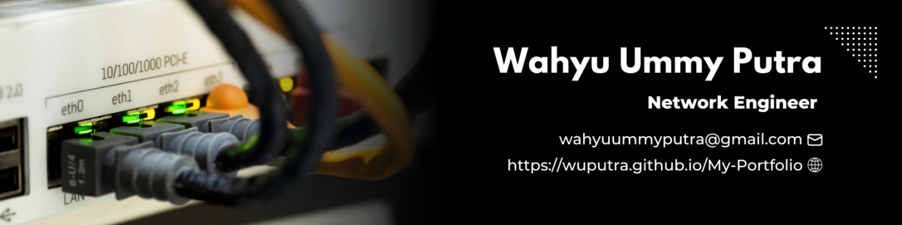

<h3 align="center">
  <marquee>Network Engineer | Cisco • MikroTik • Ruijie Cloud | Let's Build Better Networks! 🔧</marquee>
</h3>
<!--
<h3 align="center">Network Engineer | IT Infrastructure | IT Support</h3>-->

---

### About Me 

I am <b>Wahyu Ummy Putra</b>, as a Network Engineer with more than 2 years of experience at RSUD Mohammad Natsir. My expertise in designing, managing, and optimizing network usage has played a vital role in supporting hospital healthcare services, thus significantly increasing operational efficiency. With a deep understanding of network systems, I am able to work in a team, communicate, and have good leadership.
 

### With years of hands-on experience, I specialize in:
- Designing and planning network layouts for both local and wide-area systems.
- Installing network hardware and software.
- Configuring routers, switches, firewalls, and other devices.
- Ensuring continuous network operation through proactive monitoring.
- Troubleshooting and resolving any connectivity issues, bandwidth problems, or downtime.
- Implementing security policies to protect the network from unauthorized access and attacks.
- Documenting changes and updates to network hardware and software.

### Tech Stack

### Projects
🛠️ `enterprise-vlan-setup`: Cisco & MikroTik VLAN deployment  
🧰 `ruijie-cloud-lab`: AP monitoring and configuration with Ruijie Cloud  
🔐 `mikrotik-firewall-lab`: Stateful firewall for SOHO networks

### Certifications
- 📄[RCNA Routing & Switching](https://elearning.ruijienetworks.com/study/seek-certificate) 
- 📄[Network Support and Security](https://www.credly.com/badges/30c3ec7a-ab42-42ac-8987-7a61a2ed7277)
- 📄[Introduction to Cybersecurity](https://www.credly.com/badges/6c16bc44-5dd2-4739-a54c-d7e53991ae64/public_url)
- 📄[Networking Basics](https://www.credly.com/badges/af5be235-6ce2-444d-8521-97738e75fbc1)
- 📄[Computer Hardware Basics](https://www.credly.com/badges/80f4b052-01c6-40df-9ddd-f664d2f71484/public_url)
- 📄[CCNAv7: Enterprise Networking, Security and Automation](https://www.credly.com/badges/1602bbd1-9fe4-447c-9bd1-b461f1efae29)
- 📄[CCNAv7: Switching, Routing and Wireless Essentials](https://www.credly.com/badges/1ce2c472-b8bb-4fd3-934e-b9d521580d64)
- 📄[CCNAv7: Introduction to Networks](https://www.credly.com/badges/98c3d0ea-c36c-4081-8aa5-8194b8719108)

### Links
  

### ☕ Let's Connect  
   

---

📂 Explore my GitHub repos to see real-world configs, automation scripts, and lab setups. 
